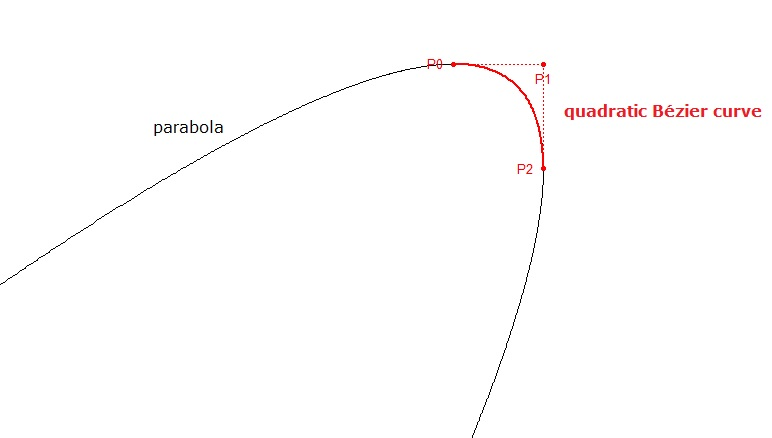

# **Tugas Kecil 2 Strategi Algoritma : Bezier Curve**
Repositori ini mengandung program untuk membuat kurva Bezier kuadratik
sebagai Tugas Kecil 2 mata kuliah Strategi dan Algoritma 2024.

  

## **Latar Belakang**
Kurva Bézier adalah kurva halus yang sering digunakan dalam desain grafis, animasi, dan manufaktur. Kurva ini dibuat dengan menghubungkan beberapa titik kontrol, yang menentukan bentuk dan arah kurva. Sebuah kurva Bézier didefinisikan oleh satu set titik kontrol P0 sampai Pn ,  dengan n disebut order (n = 1 untuk linier, n = 2 untuk kuadrat, dan seterusnya). Titik kontrol pertama dan terakhir selalu menjadi ujung dari kurva, tetapi titik kontrol antara  (jika ada) umumnya tidak terletak pada kurva. Oleh sebab itu, dalam rangka melakukan efisiensi pembuatan kurva Bézier yang sangat berguna ini, maka Anda diminta untuk mengimplementasikan pembuatan kurva Bézier dengan algoritma titik tengah berbasis _divide and conquer_.

## **Kebutuhan Program**
* Python
* Matplotlib
* Numpy
* Time

(Jika belum _diinstall_ dapat menggunakan perintah `pip install <nama_library>`)

## **Cara Menjalankan Program**
1. Clone repository dengan menjalankan `git clone https://github.com/ZachS17/Tucil2_13522016.git`
2. Navigasi kepada folder src dengan menjalankan `cd src`
3. Jalankan program dengan menjalankan `python main.py`
4. Program berjalan dalam _Command Line Interface_!

## **Cara Menggunakan Program**
1. Perintah akan diberikan melalui _terminal_ dimulai dengan jumlah titik kontrol yang ingin dimasukkan
2. Kemudian masukkan semua titik kontrol sesuai format yang diberikan
3. Masukkan jumlah iterasi yang _valid_ yang diinginkan
4. Masukkan metode penyelesaian jika titik yang dimasukkan berjumlah 3. Jika tidak, program akan menjalankan bonus yaitu algoritma _Divide and Conquer_
5. Akan muncul sebuah gambar akhir dengan semua titik di akhir
6. Jika ditutup gambarnya, akan muncul lagi animasi dari gambar solusi yang sebelumnya ditunjukkan (bonus)

## Author
| Nama | NIM |
| ---- | --- |
| Zachary Samuel Tobing | 13522016 |
